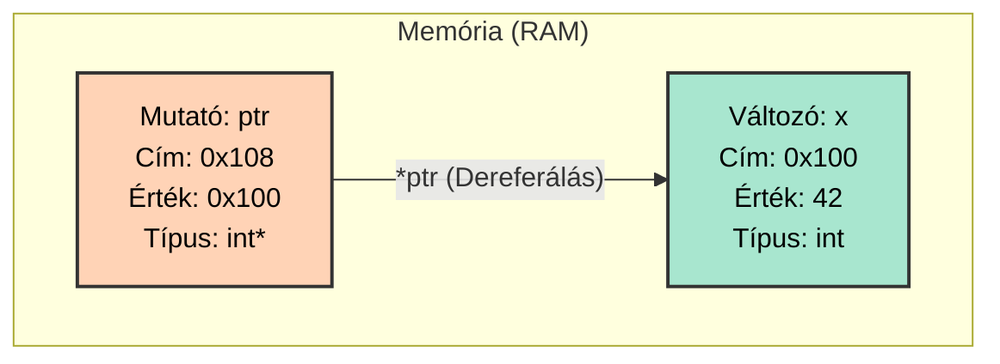
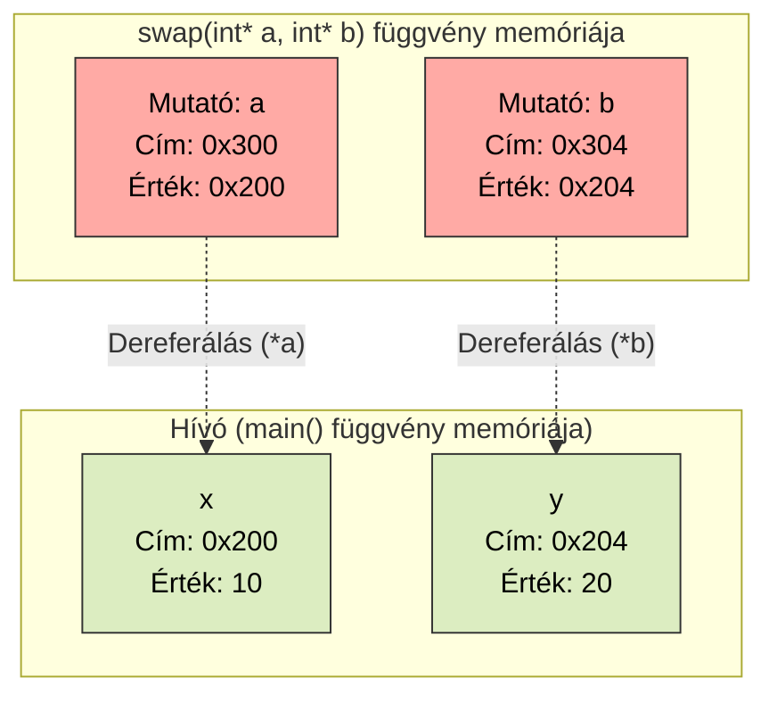
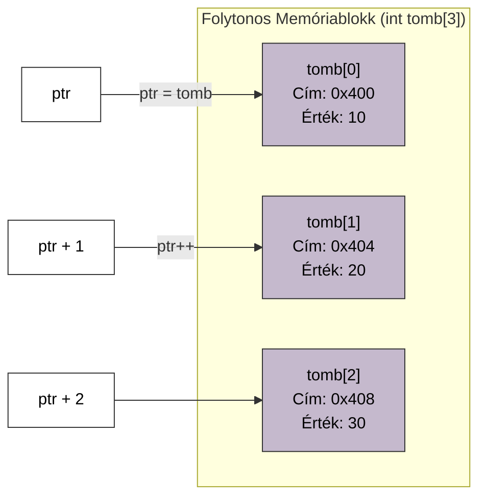
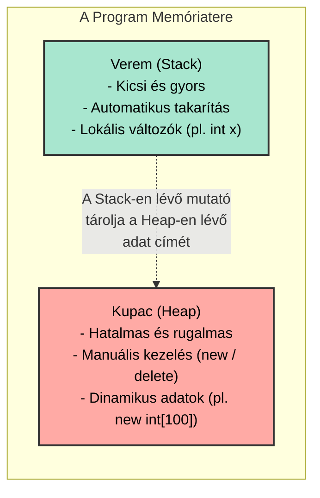
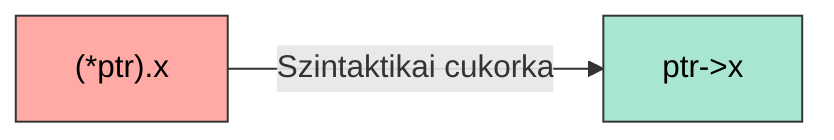

# 💻 6. Gyakorlat: A Memóriakezelés Alapjai és Mutatók (Pointers)

## Elméleti Bevezető: Hogyan működnek a mutatók?

A számítógép memóriáját (RAM) képzeld el úgy, mint egy hatalmas, sorszámozott postaládákból álló utcát. Amikor létrehozol egy változót (például `int x = 42;`), a gép lefoglal egy postaládát, beleteszi a 42-es számot, és te onnantól az `x` névvel hivatkozol rá a kódban. De mi a helyzet a postaláda fizikai sorszámával? Ez a **memóriacím**.

* **Címképző operátor (`&`):** Segítségével lekérhetjük egy változó fizikai memóriacímét (pl. `&x`). Ez általában egy hexadecimális szám (pl. `0x7ffeefbff5ac`).
* **Mutató (Pointer):** Egy olyan speciális változó, amelynek az **értéke egy memóriacím**. Nem a konkrét adatot tárolja, hanem azt, hogy *hol* van az adat. Kijelölése a típus után tett csillaggal történik (pl. `int* ptr = &x;`).
* **Dereferáló operátor (`*`):** Ha a mutató elé csillagot teszünk (pl. `*ptr`), akkor nem a memóriacímet kapjuk meg, hanem a **címen található értéket**. Ezen keresztül távolról olvashatjuk vagy akár módosíthatjuk is az eredeti változót.

Egy mérnök számára a változók nem csupán nevek, hanem konkrét fizikai rekeszek a számítógép memóriájában (RAM). Ezen a gyakorlaton megtanuljuk, hogyan kérhetjük le ezeket a címeket, és hogyan irányíthatjuk a memóriát közvetlenül.

### 1. A Mutató (Pointer) és a Változó kapcsolata

Egy mutató nem más, mint egy olyan változó, aminek a "fiókjába" nem egy hagyományos adatot (pl. számot vagy betűt) teszünk, hanem egy másik változó **memóriacímét**.

* **Címképző operátor (`&x`):** "Mondd meg az `x` memóriacímét!" (Eredmény: `0x100`).
* **Mutató deklaráció (`int* ptr = &x;`):** Létrehozunk egy `ptr` nevű változót, és beletesszük az `x` címét.
* **Dereferáló operátor (`*ptr`):** "Menj oda arra a címre, amit a `ptr` tárol, és add meg/írd át az ott lévő értéket!" (Ez a "távirányító" gombja).

---

### 2. Érték szerinti (Pass-by-Value) vs. Cím szerinti (Pass-by-Pointer) átadás

Miért van szükségünk mutatókra a függvényeknél? Ha mutatók nélkül adsz át paramétereket, a C++ lemásolja az értékeket egy teljesen új memóriaterületre. Bármit csinálsz a másolattal, az eredeti érintetlen marad. A mutatókkal viszont a függvény egy "térképet" kap az eredeti adathoz.

---

### 3. Mutatóaritmetika a tömbökön

A tömbök a memóriában szigorúan egymás mellett helyezkednek el. Ha egy mutatóhoz hozzáadsz egyet (`ptr++`), a gép nem 1 bájttal lép tovább, hanem automatikusan az adattípus méretével (egy `int` esetén 4 bájttal) ugrik a következő elemre.

**Mérnöki szabály:** A C++-ban a `tomb[2]` valójában csak "szintaktikai cukorka" (syntactic sugar). A háttérben a fordító ezt a műveletet hajtja végre: `*(tomb + 2)`. Ezért kezdi a programozás a sorszámozást mindig 0-tól! A 0 azt jelenti: "nulla lépésnyire vagyok a kezdeti memóriacímtől".

## IV. Dinamikus Memóriakezelés: Stack vs. Heap

Eddig minden változónk és statikus tömbünk mérete már a program fordításakor (compile time) ismert volt. Ezek az adatok a memóriának egy rendkívül gyors, de korlátozott méretű részére, a **Veremre (Stack)** kerültek. A C++ itt automatikusan takarít utánunk: amint egy függvény véget ér, a lokális változói megsemmisülnek.

De mi van akkor, ha csak a program futása közben (run time) derül ki, mennyi memóriára van szükségünk (például a felhasználó mondja meg, hány adatot akar tárolni)? Ilyenkor a **Kupachoz (Heap)** kell fordulnunk. Ez egy hatalmas memóriaterület, de itt nincs automatikus takarítás. Nekünk, mérnököknek kell lefoglalni (`new`) és felszabadítani (`delete`) a helyet.

---

---

---

## I. Alapozás: Hol laknak az adatok?

### 1. Feladat: Az első találkozás a memóriacímmel (`&` operátor)
Minden változónak van egy értéke és egy címe. A cím lekéréséhez a "címe" (`&`) operátort használjuk.

* **Feladat:** 1. Hozz létre egy `int gepjarmu_sebesseg = 130;` változót!
    2. Írd ki a konzolra a változó **értékét**!
    3. Írd ki a konzolra a változó **memóriacímét** a `&` operátor segítségével!
* **Mérnöki megfigyelés:** A memóriacím egy hexadecimális (16-os számrendszerbeli) érték lesz (pl. `0x7ffeefbff5ac`). Futtasd le a programot többször is! Látod, hogy a cím minden futtatáskor változhat? Ezt az operációs rendszer memóriavédelme okozza.

---

### 2. Feladat: A "távirányító" (`*` operátor)
A mutató (pointer) egy olyan speciális változó, amely nem egy hagyományos adatot tárol, hanem egy *másik változó memóriacímét*. Olyan, mint egy távirányító: ha tudod a címet, távolról is átírhatod az értéket.

* **Feladat:**
    1. Hozz létre egy `int homerseklet = 22;` változót!
    2. Definiálj egy mutatót (`int* ptr`), és add értékül neki a `homerseklet` címét!
    3. A mutató dereferálásával (`*ptr`) változtasd meg a hőmérsékletet 25-re!
    4. Írd ki az eredeti `homerseklet` változót, hogy bizonyítsd: az értéke tényleg megváltozott a mutatón keresztül!
* **Kritikus szabály:** A `ptr` a címet jelenti, a `*ptr` pedig a címen található *értéket*. A típusoknak (`int` és `int*`) szigorúan egyezniük kell!

---

### 3. Feladat: A "távirányító" gyakorlat (double változókkal)
Mielőtt tömbökkel dolgoznánk, bizonyítsuk be, hogy a mutatókon keresztül tényleg manipulálható az eredeti memóriaterület!

* **Feladat:**
  1. Hozz létre egy `double homerseklet = 21.5;` változót!
  2. Hozz létre egy rá mutató pointert: `double* ptr = &homerseklet;`
  3. Írd ki az eredeti változó értékét és memóriacímét!
  4. A mutató dereferálásával (`*ptr`) módosítsd a hőmérsékletet 25.0-ra!
  5. Írd ki ismét az eredeti `homerseklet` változó értékét (nem a mutatót!), hogy bizonyítsd a sikeres távoli módosítást.

---

### 4. Feladat: A mutatóaritmetika (Pointer Arithmetic) alapjai
A mutatókkal végezhetünk matematikai műveleteket is, de ez nem hagyományos matematika! Ha egy egész számra (`int`) mutató pointerhez hozzáadunk 1-et, a memóriacím nem 1 bájttal nő, hanem pontosan annyival, amekkora a típus mérete (egy 4 bájtos `int` esetén 4-gyel). Ez teszi lehetővé, hogy a memóriában biztonságosan lépkedjünk.

* **Feladat:**
  1. Hozz létre egy 5 elemű statikus tömböt: `int tomb[5] = {10, 20, 30, 40, 50};`
  2. Definiálj egy mutatót, amely a tömb legelső elemére mutat: `int* ptr = &tomb[0];` (Vagy egyszerűen: `int* ptr = tomb;`, hiszen a tömb neve önmagában egy mutató az első elemre!)
  3. Írj egy `for` ciklust, amely 5 lépésben végigmegy a tömbön!
  4. A ciklusmagon belül írd ki a mutató aktuális memóriacímét (`ptr`), és a címen lévő értéket (`*ptr`)!
  5. A ciklus végén léptesd a mutatót a következő elemre a `ptr++` utasítással!

* **Mérnöki fókusz:** Figyeld meg a konzolon a kiírt memóriacímeket! Látni fogod, hogy a hexadecimális címek pontosan 4-gyel (vagy a rendszereden az `int` méretével) növekszenek minden lépésben. A C++ fordító intelligensen kezeli a típusméreteket a mutatóaritmetika során. Ezt a mechanizmust használja a háttérben a `tomb[i]` indexelés is!

## II. Mutatók és Függvények (Pass-by-Pointer)

### 1. Feladat: A klasszikus Csere (Swap) probléma
Ha egy C++ függvénynek átadsz egy változót, a gép alapértelmezés szerint készít róla egy másolatot. Bármit is csinálsz a függvényen belül, az eredeti változó érintetlen marad. Ahhoz, hogy a függvény "visszanyúljon" a hívóhoz, a változók memóriacímét kell átadni.

* **Feladat:**
  1. Írj egy `void swapValues(int* a, int* b)` függvényt, amely két mutatót vár paraméterként!
  2. A függvényen belül cseréld fel a két memóriacímen lévő értéket egy átmeneti változó (`int temp`) segítségével!
     *(Vigyázz: a mutatókat dereferálni kell a `*` operátorral, hogy az értékeket cseréld, ne a címeket!)*
  3. A `main` függvényben hozz létre két változót (`x = 10`, `y = 20`)!
  4. Hívd meg a függvényt, és add át a változók címeit a `&` operátorral (`swapValues(&x, &y)`).
  5. Írd ki az `x` és `y` értékét a hívás előtt és után, hogy bizonyítsd a sikeres cserét!

---

### 2. Feladat: Több visszatérési érték (Min-Max kereső)
A `return` utasítás egyetlen nagy hátránya, hogy csak egyetlen értéket tud visszaadni. Mi van, ha egy függvényből két eredményt is szeretnénk kinyerni? A mérnöki megoldás: adjunk át mutatókat azokhoz a változókhoz, ahová az eredményeket menteni akarjuk!

* **Feladat:**
  1. Írj egy `void findMinMax(int tomb[], int meret, int* minOut, int* maxOut)` függvényt!
  2. A függvény keressen rá a tömb legkisebb és legnagyobb elemére egyetlen `for` ciklus segítségével.
  3. A megtalált minimumot írja bele a `minOut` által mutatott memóriacímre, a maximumot pedig a `maxOut` címre!
  4. A `main` függvényben hozz létre egy tömböt, illetve két változót (`legkisebb`, `legnagyobb`).
  5. Hívd meg a függvényt úgy, hogy átadod a két tároló változó memóriacímét, majd írd ki a kapott eredményeket!

* **Sensei megjegyzése:** Amikor egy tömböt adsz át a függvénynek (`int tomb[]`), a háttérben az valójában egy mutatóvá alakul (array decay), amely a tömb első elemére mutat (`int* tomb`). Ezért nem másolódik le a teljes tömb a memóriában!

## III. Mutatók a gyakorlatban: Függvények és Címek

### 1. Feladat: Szenzorkalibráció (Közvetlen memóriamódosítás)
A mérnöki gyakorlatban a szenzorok idővel elállítódnak (drift), így szoftveres kalibrációra, azaz eltolásra (offset) van szükség. Ha egyszerűen csak átadnánk a mért értéket egy függvénynek, a gép csak a másolatot módosítaná, a valódi adat érintetlen maradna.

* **Feladat:** 1. Írj egy `void applyCalibration(double* measurement, double offset)` függvényt!
  2. A függvény a mutató dereferálásával (`*measurement`) adja hozzá az `offset` értékét a memóriacímen lévő eredeti adathoz!
  3. A `main` függvényben hozz létre egy változót: `double nyomas = 1013.25;`.
  4. Hívd meg a függvényt (pl. `-5.0` offsettel), de ne az értéket, hanem a `nyomas` memóriacímét (`&nyomas`) add át!
  5. Írd ki a változó új értékét a hívás után, hogy lásd a módosítást!

---

### 2. Feladat: Kettős visszatérés (Osztás hányadossal és maradékkal)
A C++ `return` utasítása szigorúan csak egyetlen értéket tud visszaadni. Mi a teendő, ha egy matematikai műveletnek két eredménye is van? A mutatók jelentik az elegáns megoldást: kimeneti paramétereket (output parameters) hozunk létre velük.

* **Feladat:**
  1. Írj egy `bool safeDivision(int a, int b, int* quotient, int* remainder)` függvényt!
  2. A függvény először ellenőrizze, hogy az osztó (`b`) nem nulla-e! Ha nulla, térjen vissza `false` értékkel (hibajelzés).
  3. Ha `b` nem nulla, számítsa ki az egészosztás hányadosát és maradékát, és a mutatókon keresztül (`*quotient` és `*remainder`) írja be őket az erre kijelölt eredeti változókba! Majd térjen vissza `true` értékkel (sikeres futás).
  4. A `main`-ben teszteld a függvényt egy sikeres (pl. 10 / 3) és egy nullával való osztással!

---

### 3. Feladat: Jelszűrés / Clipping (Tömb átadása mutatóként)
Amikor egy tömböt átadsz egy függvénynek (pl. `int data[]`), a C++ a háttérben nem másolja le a tömb összes elemét — ez hatalmas memóriapazarlás lenne. Ehelyett csendben átalakítja a paramétert egy mutatóvá (`int* data`), amely a tömb legelső elemére mutat.

* **Feladat:**
  1. Képzelj el egy audioszenzort, amely néha túlvezérelt, extrém kiugró értékeket rögzít. Írj egy `void clipSignal(int* signal, int size, int maxLimit)` függvényt!
  2. A függvény egy `for` ciklussal menjen végig a memóriablokkon. Ha egy érték nagyobb, mint a `maxLimit`, "vágja le", azaz írja felül a `maxLimit` értékével!
  3. A `main`-ben hozz létre egy statikus tömböt (pl. `{10, 50, 120, 40, 200, 15}`), hívd meg a függvényt 100-as limittel, majd egy új ciklussal írd ki a már "megtisztított" jelet!

---

## IV. Dinamikus memória: Kilépés a korlátok közül

### 1. Feladat: A Heap (Kupac) használata
Eddig minden változónk a Stack-en (verem) jött létre, és automatikusan megsemmisült a blokk végén. Ha nagy adatokat akarunk tárolni, vagy mi akarjuk szabályozni az élettartamot, a dinamikus memóriát (Heap) kell használnunk a `new` és `delete` operátorokkal.

* **Feladat:**
    1. Foglalj le dinamikusan egy `int` típusú helyet a memóriában a `new int` utasítással, és az eredményt mentsd el egy `int* adat` mutatóba!
    2. Adj neki értéket (pl. 42), és írd ki a konzolra!
    3. Szabadítsd fel a memóriát a `delete adat;` utasítással!
    4. Mutasd meg a mutatót a `nullptr` értékre (nullpointer), hogy elkerüld a "dangling pointer" (lógó mutató) hibát!

---

### 2. Feladat: A Dinamikus Változó (`new` és `delete`)
Lássuk az alapokat! Kérjünk a rendszertől memóriát a futás során.

* **Feladat:**
  1. Foglalj le dinamikusan egy `double` típusú helyet a Heap-en, és a kapott címet mentsd el egy mutatóba: `double* dinamikusAdat = new double;`
  2. Adj neki értéket (pl. `3.14`) a dereferáló operátorral (`*dinamikusAdat = 3.14;`), és írd ki a memóriacímet, valamint az értéket!
  3. **Kritikus lépés:** Szabadítsd fel a memóriát a `delete dinamikusAdat;` utasítással!
  4. Állítsd a mutatót `nullptr` értékre, hogy ne maradjon a memóriában "lógó mutató" (dangling pointer), ami egy már felszabadított címre mutat.

---

### 3. Feladat: A Dinamikus Tömb
A statikus tömbök (pl. `int tomb[10];`) mérete kőbe van vésve. A Heap segítségével végre akkora tömböt hozhatunk létre, amekkorát a felhasználó kér.

* **Feladat:**
  1. Kérj be a felhasználótól egy egész számot (`meret`)!
  2. Foglalj le a Heap-en egy ekkora méretű egész számos tömböt: `int* dinamikusTomb = new int[meret];`
  3. Írj egy `for` ciklust, amely feltölti a tömböt véletlen számokkal vagy a ciklusváltozó értékével, és írd is ki azokat!
  4. **Kritikus lépés:** Szabadítsd fel a tömböt! Mivel tömböt foglaltunk, a felszabadításhoz kötelező a szögletes zárójel használata: `delete[] dinamikusTomb;`

and delete[] operators]

---

### 4. Feladat: A rettegett Memóriaszivárgás (Memory Leak)
Ha lefoglalsz egy területet a Heap-en a `new` operátorral, de elfelejted meghívni a `delete`-et, a lefoglalt memória "beragad". A program futása alatt az operációs rendszer úgy tudja, hogy az a terület még foglalt, hiába nem használod már. Ha ez egy ciklusban történik, a program addig eszi a RAM-ot, amíg össze nem omlik.

* **Feladat (A hiba szimulálása):**
  1. Írj egy végtelen ciklust (`while(true)`).
  2. A cikluson belül foglalj le dinamikusan egy hatalmas tömböt: `int* leak = new int[1000000];` (Ez 4 Megabájt körönként).
  3. Szándékosan **NE** írj `delete[] leak;` utasítást a ciklusba!
  4. Futtasd a programot, és nyisd meg a számítógéped Feladatkezelőjét (Task Manager)! Figyeld meg, hogyan kúszik az egekbe a program memóriafogyasztása másodpercek alatt, mielőtt az operációs rendszer kilövi a folyamatot!
  * **Mérnöki szabály:** Minden `new` operátorhoz lennie kell egy pontosan egy `delete` operátornak a kódban. Nincs kivétel.

### 🚨 Sensei megjegyzése: Miért kritikus probléma a memóriaszivárgás az iparban?

Egy egyszerű iskolai feladatnál talán fel sem tűnik egy apró szivárgás, hiszen a program pár másodperc múlva leáll, és az operációs rendszer visszaveszi a memóriát. A valódi mérnöki problémák a hosszan futó rendszereknél kezdődnek:

1. **Rendszerszintű lassulás (Thrashing):** Amikor a fizikai memória (RAM) kezd megtelni, az operációs rendszer kétségbeesetten próbál helyet csinálni. Ezt úgy teszi, hogy a ritkábban használt memóriablokkokat a sokkal lassabb merevlemezre (lapozófájl / swap) mozgatja. A gép drasztikusan belassul, a válaszidők megnőnek.
2. **Out of Memory (OOM) Összeomlás:** Ha a memória teljesen elfogy, és a program újabb `new` utasítást ad ki, az operációs rendszer megtagadja a kérést. Ez kezeletlen kivételhez (exception) és a program azonnali összeomlásához vezet. Linux szervereknél az *OOM Killer* nevű mechanizmus ilyenkor kíméletlenül kilövi a legtöbb memóriát fogyasztó folyamatot.
3. **Késleltetett katasztrófa (Szerverek és Beágyazott rendszerek):** Egy felhőben futó backend szervernél, vagy egy orvosi műszer mikrokontrollerénél — aminek hónapokig kell újraindítás nélkül üzemelnie —, egyetlen ciklusban elvesztett pár bájtos adat is garantált rendszerösszeomlást okoz idővel. Emiatt a C/C++ világban a memóriaszivárgás az egyik legsúlyosabb biztonsági és stabilitási hiba.
4. **Végzetes ütközés a Mikrovezérlőkön (Stack-Heap Collision):**
   Egy beágyazott rendszerben (például egy Arduino vagy egy ipari ARM Cortex chip) nincs operációs rendszer, nincs memóriavédelmi egység (MMU), és a RAM mérete is nevetségesen kicsi (gyakran csak 2-8 Kilobájt). 
   - A memóriatérkép úgy néz ki, hogy a Kupac (Heap) lentről felfelé növekszik, a Verem (Stack) pedig fentről lefelé. Ha memóriaszivárgásod van, a Kupac addig nő, amíg frontálisan **bele nem ütközik a Verembe**.
   - **A következmény:** Nem kapsz hibaüzenetet. A szivárgó Heap csendben felülírja a Stack-en lévő lokális változóidat és a függvények visszatérési címeit. A mikrokontroller "megőrül": rossz kivezetéseket (pin-eket) kapcsol be, hibás adatokat küld a szenzoroknak, majd egy végtelen újraindulási ciklusba (reset loop) vagy egy végzetes fagyásba (Hard Fault) kerül. Ezért tiltják meg a Senior mérnökök a dinamikus memóriafoglalást (a `new` használatát) a biztonságkritikus beágyazott rendszerekben (pl. autók fékrendszere, orvosi műszerek).
---

## V. Mutatók és Struktúrák: A Nyíl (`->`) Operátor

Amikor egy struktúrára (struct) mutató pointerünk van, a belső adattagok elérése trükkössé válik. A pont (`.`) operátor precedenciája (kötési ereje) magasabb, mint a dereferáló (`*`) operátoré. Így a `*ptr.adat` szintaktikai hibát dob, mert a gép a mutató memóriacímének próbálja lekérni az 'adat' nevű tagját, ami értelmetlen.

A gép által elvárt helyes forma a `(*ptr).adat` lenne, de ezt hosszú távon borzalmas gépelni. Erre találták ki a mérnökök az elegáns **nyíl operátort (`->`)**!

---

### 1. Feladat: Szenzoradatok módosítása (Egyszerű struktúra és mutató)
Modellezzünk egy IoT (Internet of Things) hőmérsékletszenzort!

* **Feladat:**
  1. Definiálj egy `struct Sensor` típust két adattaggal: `int id` és `double temperature`.
  2. A `main` függvényben hozz létre egy statikus szenzort, és adj neki kezdőértékeket (pl. ID: 1, Hőmérséklet: 22.5)!
  3. Hozz létre egy mutatót, ami erre a szenzorra mutat: `Sensor* ptr = &elsoSzenzor;`
  4. **A lényeg:** A nyíl operátor segítségével írd felül a szenzor hőmérsékletét 25.0-ra (`ptr->temperature = 25.0;`)!
  5. Írd ki az új adatokat a konzolra, szintén kizárólag a `->` operátort használva!

---

### 2. Feladat: Dinamikus Részecske (A Heap és a Struct találkozása)
A fizikaszimulációkban a részecskéket (pontokat) gyakran dinamikusan hozzuk létre a memóriában, amikor megjelennek, és megsemmisítjük őket, amikor eltűnnek.

* **Feladat:**
  1. Definiálj egy `struct Particle` típust (`x`, `y`, `z` valós számú koordinátákkal)!
  2. Foglalj le egy ilyen részecskét dinamikusan a Heap-en a `new` operátorral: `Particle* p = new Particle;`
  3. A nyíl operátor (`->`) használatával töltsd fel az `x`, `y`, `z` komponenseket tetszőleges értékekkel!
  4. Írj egy `void printParticle(Particle* part)` függvényt, amely paraméterként egy mutatót vár, és a nyíl operátorral kiírja a részecske adatait a konzolra!
  5. Hívd meg a függvényt a `main`-ben, majd **kötelező mérnöki lépésként** szabadítsd fel a memóriát a `delete p;` utasítással!

## VI. Emelt Szintű Feladatok (Szorgalmi / Boss Fight)

Aki idáig eljutott, az felkészült a valódi mérnöki problémákra. Ezek a feladatok a beágyazott rendszerek és a grafikai motorok világába adnak betekintést.

### 1. Feladat: Hardveres regiszter szimuláció (Beágyazott rendszerek)
A mikrovezérlők (pl. Arduino, ARM Cortex) programozásakor a fizikai kivezetéseket memóriacímeken keresztül vezéreljük. Mutatók nélkül lehetetlen hardvert programozni.

* **Feladat:** 1. Hozz létre egy `unsigned char portA = 0x00;` változót, amely egy 8-bites hardveres portot szimulál.
    2. Definiálj egy mutatót (`unsigned char* ptr = &portA;`)!
    3. A mutató dereferálásával állíts be minden bitet 1-re (`0xFF`)!
    4. Írd ki a konzolra a mutató által tárolt memóriacímet és a dereferált értéket!

---

### 2. Feladat: Framebuffer lefoglalása (Számítógépes Grafika)
A valós idejű grafikában a képernyő tartalmát egy hatalmas, dinamikusan lefoglalt, egydimenziós memóriablokkban (framebuffer) tároljuk.

* **Feladat:**
    1. Kérd be a felhasználótól a képernyő felbontását (szélesség és magasság)!
    2. Foglalj dinamikusan egy egydimenziós tömböt a `new` operátorral (`new int[meret]`).
    3. Írj egy ciklust, amely feltölti a memóriát `0` értékkel (fekete képernyő)!
    4. Szabadítsd fel a lefoglalt tömböt a `delete[]` operátorral! (Figyelem: tömbök esetén kötelező a `[]` használata a `delete` után!)

---

### 3. Feladat: Képinvertálás mutatóaritmetikával (Pointer Arithmetic)
A tömbindexelés (`tomb[i]`) a háttérben valójában mutatóaritmetikát hajt végre (`*(tomb + i)`). Ha hardverközeli, teljesítménykritikus kódot írunk, a pointerek közvetlen léptetése a leggyorsabb.

* **Feladat:** 1. Használd a 6. feladat framebuffere-t! Hozz létre egy mutatót, ami a tömb elejére mutat.
    2. Egy ciklusban használd a `ptr++` műveletet, hogy végiglépkedj a memórián indexelés nélkül!
    3. Bitenkénti negációval (`~`) módosítsd minden pixel értékét!