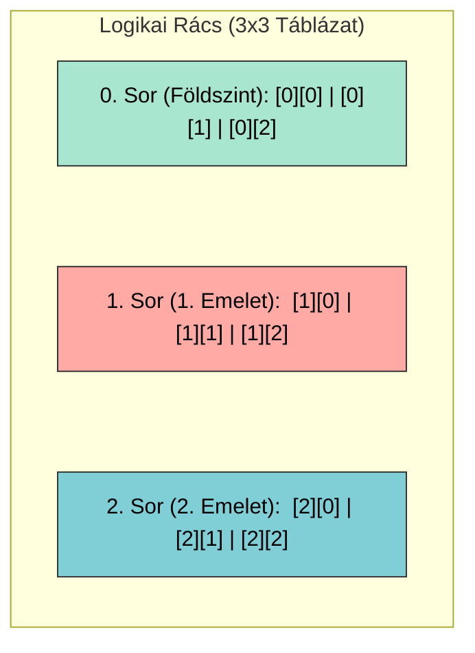

# 📊 7. Gyakorlat: Többdimenziós Tömbök Elmélete

A 2D tömbök (mint a mátrixok) a programozásban csupán kényelmi eszközök. Ahhoz, hogy magabiztosan használd őket, pontosan értened kell, mi a különbség aközött, amit te látsz, és aközött, amit a számítógép hardvere lát.

## I. A Logikai Nézet (Amit a programozó lát)

Amikor létrehozol egy `int tomb[3][3]` változót, az agyad automatikusan egy táblázatot vagy egy sakktáblát képzel el.
* Az **első index** mindig a sort (Y tengely, vagy az épület emelete) jelenti.
* A **második index** mindig az oszlopot (X tengely, vagy a szobaszám) jelenti.
* **Aranyszabály:** A számozás mindig `[0][0]`-val indul a bal felső sarokból!

---

## II. A Fizikai Nézet (Amit a számítógép lát)

Itt jön a mérnöki csavar! A számítógép memóriája (RAM) nem egy rácsos papír, hanem egyetlen végtelenül hosszú, egyenes szalag. Nem létezik benne olyan, hogy "alatta" vagy "felette".

A C++ egy **Row-major order** (sorfolytonos) nevű trükköt alkalmaz: fogja a táblázatod sorait, és egyszerűen egymás mögé ragasztja őket egyetlen hosszú, egydimenziós memóriablokkba.

```mermaid
flowchart LR
    subgraph "A Fizikai Valóság (Lineáris Memória)"
        direction LR
        
        %% 0. sor elemei
        M00["[0][0]"] --> M01["[0][1]"] --> M02["[0][2]"]
        
        %% 1. sor elemei
        M02 --> M10["[1][0]"]
        M10 --> M11["[1][1]"] --> M12["[1][2]"]
        
        %% 2. sor elemei
        M12 --> M20["[2][0]"]
        M20 --> M21["[2][1]"] --> M22["[2][2]"]
    end
    
    %% Színezés a sorok elkülönítésére
    style M00 fill:#a8e6cf,stroke:#333,color:#000
    style M01 fill:#a8e6cf,stroke:#333,color:#000
    style M02 fill:#a8e6cf,stroke:#333,color:#000
    
    style M10 fill:#ffaaa5,stroke:#333,color:#000
    style M11 fill:#ffaaa5,stroke:#333,color:#000
    style M12 fill:#ffaaa5,stroke:#333,color:#000
    
    style M20 fill:#80ced6,stroke:#333,color:#000
    style M21 fill:#80ced6,stroke:#333,color:#000
    style M22 fill:#80ced6,stroke:#333,color:#000
```

### 🧠 Sensei magyarázata: Miért fontos ez?
Ha kiadod a `tomb[1][2]` parancsot, a gép nem egy táblázatban keresgél. Kiszámolja a lineáris indexet a memóriában: átugorja a teljes nulladik sort (3 elem), majd rálép a következő sor 2-es indexű elemére.
Ha ezt a lineáris koncepciót megérted, a mutatókkal (pointerek) történő képfeldolgozás vagy a játékfejlesztés gyerekjáték lesz!