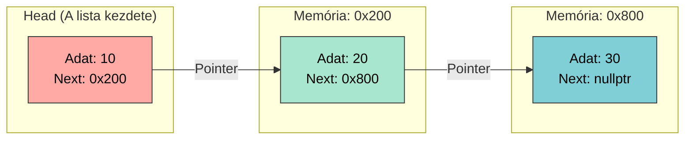

# 🔗 8. Gyakorlat: Dinamikus Adatszerkezetek Elmélete

A hagyományos tömbök (még a dinamikusan lefoglaltak is) egy hatalmas fizikai hátránnyal küzdenek: **egybefüggő memóriablokkot** (contiguous memory) követelnek meg. Ha a számítógép memóriája töredezett (fragmentált), hiába van összesen elegendő szabad hely, az operációs rendszer megtagadja a tömb létrehozását.

A megoldás egy sokkal rugalmasabb mérnöki megközelítés: a **Láncolt Lista (Linked List)**.

## I. A Láncolt Lista Alapjai

A láncolt listában az adatok nincsenek egymás mellett a memóriában. Bárhol elhelyezkedhetnek a Kupacon (Heap), a kapcsolatot pedig **mutatók (pointerek)** biztosítják közöttük.

### A Csomópont (Node)
A láncolt lista építőköve a csomópont. Két szorosan összetartozó részből áll:
1. **Adat (Payload):** A tényleges információ (pl. egy szám, egy név, vagy egy objektum).
2. **Mutató (Next Pointer):** Egy memóriacím, amely megmutatja, hol található a lánc következő szeme.

**Mérnöki Alapszabályok:**
* **Head (Fej):** A lista legelső elemére mutató pointer. Ez a "horgony". Ha a Head mutatót felülírod vagy elveszíted, a teljes lista elérhetetlenné válik (Memory Leak).
* **Nullpointer (`nullptr`):** A lista legutolsó elemének mutatója mindig a semmibe mutat. Ebből tudja az algoritmus, hogy a lánc véget ért.

---

## II. Szigorú Szabályrendszerek: LIFO és FIFO

A nyers láncolt listába bárhova beszúrhatunk és bárhonnan törölhetünk elemet. A szoftvertervezésben azonban gyakran van szükségünk kiszámítható, korlátozott hozzáférésű adatszerkezetekre. Ha a láncolt listára szigorú hozzáférési szabályokat húzunk, megkapjuk a programozás két legfontosabb eszközét.

### 1. A Verem (Stack) - LIFO Logika
A **LIFO (Last In, First Out)**, azaz "Utolsóként be, Elsőként ki" elv pontosan úgy működik, mint egy halom tányér a menzán. Csak a legfelső tányérhoz férsz hozzá: oda teszed az újat, és onnan veszed el a következőt.

* **Adatmozgás a láncolt listában:**
    * **Push (Beszúrás):** Az új csomópontot **mindig a lista legelejére (a Head elé)** fűzzük be. Az új elem lesz az új Head.
    * **Pop (Kivétel):** Mindig a **Head elemet** olvassuk ki és töröljük (`delete`), majd a mögötte lévő láncszemet tesszük meg új Head-nek.
* **Ipari felhasználás:** A C++ függvényhívások (Call Stack), a programok "Visszavonás" (Undo) funkciója, vagy a webböngészők "Vissza" gombja mind LIFO vermet használnak.

---

### 2. A Sor (Queue) - FIFO Logika
A **FIFO (First In, First Out)**, azaz "Elsőként be, Elsőként ki" elv a klasszikus bolti kassza sora. Aki előbb állt be, azt szolgálják ki először. Nincs tolakodás.

* **Adatmozgás a láncolt listában:**
    * **Enqueue (Beállás a sorba):** Az új csomópontot **mindig a lista legvégére** csatoljuk.
    * **Dequeue (Kiszolgálás):** Mindig a lista **legelejéről (Head)** veszünk el és törlünk elemet.
* **A Mérnöki Trükk (A Tail mutató):** Ha egy millió elemes sornál mindig végig kellene iterálnunk a Head-től a végéig, hogy beszúrjunk egy új elemet, a programunk drasztikusan lelassulna. A megoldás: a Head mellett folyamatosan karbantartunk egy **Tail (Farok)** mutatót is, amely mindig a legutolsó elemre mutat. Így a sor végére történő beszúrás azonnali ($O(1)$ időkomplexitású) műveletté válik.
* **Ipari felhasználás:** Hálózati csomagok (routerek) pufferelése, operációs rendszerek feladatütemezése (Task Scheduling), vagy a nyomtatók várakozási sora.