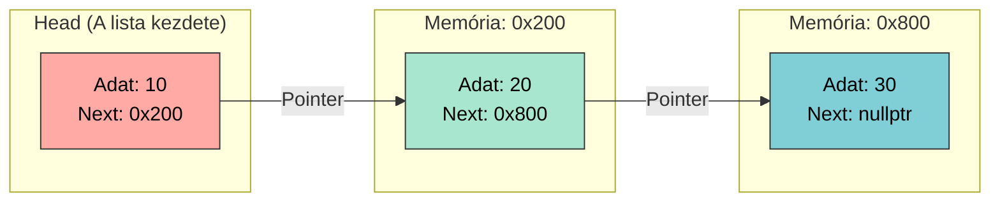

# 🧮 8. Gyakorlat: Mátrixműveletek és Dinamikus Adatszerkezetek

## I. Lineáris Algebra a Memóriában (Mátrixok)

A 2D tömbök matematikai megfelelői a mátrixok. Bár a számítógép memóriája lineáris, az algoritmusaink kétdimenziós térben dolgoznak velük.

### 1. Feladat: Mátrixok Összeadása (Képrétegek egyesítése)
Két azonos dimenziójú mátrix összeadása a legegyszerűbb művelet. A megfelelő pozícióban lévő elemeket egyszerűen összegezzük: $C_{i,j} = A_{i,j} + B_{i,j}$. Ezt használjuk a grafikában például két átlátszó képréteg (layer) egymásra vetítésénél.

* **Feladat:**
    1. Hozz létre két darab $3 \times 3$-as mátrixot (`int A[3][3]` és `int B[3][3]`), és töltsd fel őket tetszőleges számokkal!
    2. Hozz létre egy harmadik, `int C[3][3]` mátrixot az eredménynek!
    3. Írj egy kettős `for` ciklust, amely elemenként elvégzi az összeadást, és az eredményt a `C` mátrixba menti!
    4. Egy újabb ciklussal formázottan (tabulátorokkal) írd ki a `C` mátrixot a képernyőre!

---

### 2. Feladat: Mátrixszorzás (A 3D transzformációk motorja)
Itt hullik el a kódolók többsége. Két mátrix összeszorzása nem elemenként történik! Az első mátrix **sorait** szorozzuk a második mátrix **oszlopaival** (Dot Product).

Matematikai definíció egy $m \times n$ és egy $n \times p$ méretű mátrix szorzatára:
$$C_{i,j} = \sum_{k=1}^{n} A_{i,k} \cdot B_{k,j}$$

* **Feladat:**
    1. Hozz létre egy $2 \times 3$-as `A` mátrixot és egy $3 \times 2$-es `B` mátrixot!
    2. Hozz létre egy $2 \times 2$-es `Eredmeny` mátrixot, és minden elemét inicializáld $0$-ra!
    3. **A Mérnöki Kihívás:** Írj egy **hármas** egymásba ágyazott `for` ciklust!
        - A legkülső ciklus az `A` sorain megy végig ($i$).
        - A középső ciklus a `B` oszlopain megy végig ($j$).
        - A legbelső ciklus végzi el a szorzatösszeget ($k$).
    4. A képlet a belső ciklusban: `Eredmeny[i][j] += A[i][k] * B[k][j];`
    5. Írd ki a végeredményt!

---

## II. Elmélet: A Láncolt Listák (Linked Lists)

A statikus és a dinamikus tömböknek (Heap) van egy hatalmas fizikai hibája: **egybefüggő memóriablokkot** követelnek meg. Ha kell 100 Megabájt, és a memóriában csak $50 + 50$ Megabájtnyi töredék (fragmentált) szabad hely van, a tömbfoglalás elszáll (Out of Memory), pedig fizikailag lenne elég RAM.

A megoldás: A Láncolt Lista. Szétszórjuk az adatokat a memóriában bárhova, ahol van hely, és **mutatókkal (pointerekkel)** láncoljuk őket egymáshoz.

### A Csomópont (Node) Anatómája

Minden adatelem egy különálló kis "doboz", ami két dolgot tartalmaz:
1. Magát az adatot (Payload).
2. Egy mutatót, ami megmondja, hol lakik a következő doboz a memóriában.


### A Kódstruktúra

A C++-ban ezt egy önmagára mutató struktúrával (Struct) valósítjuk meg:

```cpp
struct Node {
    int adat;
    Node* kovetkezo;
};
```

**Mérnöki Szabályok:**
* A lista első elemét mindig **Head**-nek hívjuk. Ha ezt elveszíted, a teljes lista elvész a memóriában (Memory Leak)!
* A lista legutolsó elemének mutatója mindig a "semmibe" mutat, azaz az értéke kötelezően `nullptr`. Ebből tudja a gép, hogy vége a láncnak.

---

## III. Alapozó Feladatok: A Lista Építése

Ne használjunk egyelőre dinamikus memóriát, csak értsük meg a mutatók összekapcsolását a Veremben (Stack)!

### 1. Feladat: A Manuális Láncolás (Drótozás)
* **Feladat:**
    1. Hozz létre három különálló `Node` változót a `main` függvényben: `n1`, `n2` és `n3`!
    2. Adj mindegyiknek tetszőleges értéket (pl. 10, 20, 30) a pont operátorral (`n1.adat = 10;`)!
    3. Kösse össze őket a memóriában! Az `n1.kovetkezo` mutasson az `n2` memóriacímére, az `n2.kovetkezo` pedig az `n3` címére!
    4. Az `n3.kovetkezo` értékét állítsd `nullptr`-re!
    5. Bizonyítsd be a láncolást: írd ki az `n2` adatát, de **kizárólag** az `n1` változót használva! *(Tipp: `n1.kovetkezo->adat`)*

---

### 2. Feladat: A Lista Bejárása (Traversal)
Ha van egy 1000 elemes listánk, nem írhatunk le 1000 darab nyíl operátort. Egy `while` ciklussal és egy mozgó mutatóval (iterator) kell végiglépkednünk rajta.

* **Előfeltétel:** Használd a 3. feladatban összedrótozott `n1`, `n2`, `n3` csomópontokat!
* **Feladat:**
    1. Hozz létre egy mutatót (`Node* aktualis`), és állítsd be úgy, hogy a lista legelejére mutasson (`&n1`)!
    2. Írj egy `while` ciklust, amely addig fut, amíg az `aktualis` mutató el nem éri a `nullptr` értéket!
    3. A ciklusmagon belül írd ki az `aktualis->adat` értékét!
    4. **Kritikus lépés:** A ciklusmag végén léptesd a mutatót a következő elemre: `aktualis = aktualis->kovetkezo;`

---

### 3. Feladat: Dinamikus Lista és a Memóriaszivárgás (Boss Fight)
A valóságban a listákat mindig dinamikusan (Heap) építjük a `new` operátorral, hogy futás közben bármeddig növekedhessenek. Amikor viszont végzünk velük, nekünk kell egyesével megsemmisíteni a láncszemeket.

* **Feladat:**
    1. Hozz létre egy `Node* head = new Node;` dinamikus csomópontot! Adj neki értéket, a mutatója legyen `nullptr`!
    2. Készíts egy második dinamikus csomópontot is, és kösd hozzá a `head` végéhez: `head->kovetkezo = new Node;`!
    3. Adj értéket a második csomópontnak is a `head`-en keresztül, és zárd le a listát `nullptr`-rel!
    4. Egy `while` ciklussal járd be és írd ki az elemeket (mint a 4. feladatban)!
    5. **Mérnöki Takarítás:** Írj egy újabb `while` ciklust, amely végigmegy a listán, és a `delete` operátorral egyesével felszabadítja a csomópontokat! *(Vigyázz: mielőtt törölsz egy Node-ot, ki kell mentened a `kovetkezo` mutatóját egy átmeneti változóba, különben elszakad a lánc, és nem találod meg a többi elemet!)*

### 4. Feladat: A Verem (Stack / LIFO)
A Verem (Last In, First Out) pontosan úgy működik, mint egy halom tányér a menzán. Csak a legfelsőhöz férsz hozzá: oda teszed az újat, és onnan veszed el a következőt.

* **Feladat:** Készíts egy Verem logikát láncolt listával!
    1. Írj egy `push(Node*& head, int adat)` függvényt, amely egy új csomópontot (Node) hoz létre dinamikusan, és **mindig a lista legeslegelejére (Head)** fűzi be! Az új elem lesz az új Head.
    2. Írj egy `pop(Node*& head)` függvényt! Olvasd ki a Head elem adatát, majd **törold (delete)** a Head csomópontot, és a mögötte lévő elemet tedd meg új Head-nek!

### 5. Feladat: A Sor (Queue / FIFO)
A Sor (First In, First Out) a klasszikus bolti kassza: aki előbb állt be, az fut le először. Új elem a sor végére jön, a kiszolgálás az elejéről történik.

* **Feladat:** Készíts egy Sor logikát!
    1. Írj egy `enqueue(Node*& head, int adat)` függvényt! Egy `while` ciklussal menj el a láncolt lista **legutolsó** eleméig (ahol a mutató `nullptr`), és fűzd a lánc végére az új csomópontot! *(Kihívás: Meg tudod oldani ciklus nélkül, egy `tail` mutató fenntartásával?)*
    2. Írj egy `dequeue(Node*& head)` függvényt! Ez pontosan ugyanúgy működik, mint a Verem `pop()` függvénye: a lista **elejéről** vesz el és töröl.

### 6. Feladat: A Lista Rendezése (Bubble Sort)
Egy tömböt könnyű rendezni a sorszámok (indexek) miatt. Egy láncolt listánál viszont csak a mutatókon keresztül haladhatunk előre.

* **Feladat:** Írj egy `sortList(Node* head)` függvényt, amely növekvő sorrendbe rendezi a láncolt listát!
    * **A mérnöki kompromisszum:** Ne a memóriacímeket (mutatókat) cserélgesd, mert az könnyen elszakítja a láncot! Ehelyett cseréld fel a csomópontok belsejében lévő `adat` értékeket!
    * Használj két egymásba ágyazott `while` ciklust a klasszikus buborékrendezés (Bubble Sort) logikájával. Addig cserélgesd a szomszédos értékeket, amíg a lista rendezett nem lesz.